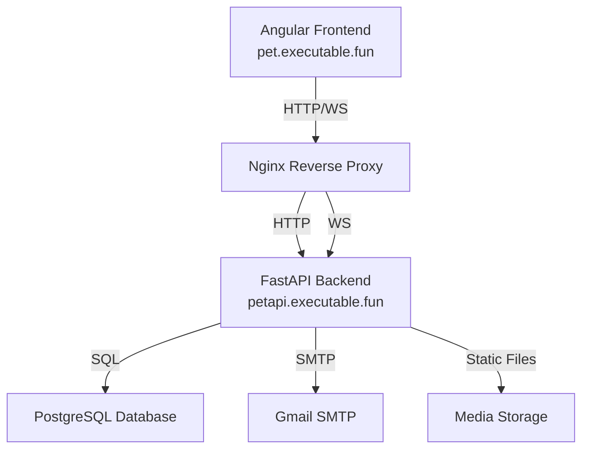

# 🏗️ System Architecture

## Overview

Haustier Waage follows a modern, scalable architecture designed for real-time pet weight tracking. The system uses a monolithic backend with WebSocket support for real-time updates, combined with a responsive frontend application.

## System Components

## Component Details

### Frontend Layer (Angular 17)

- Single-page application built with Angular
- Real-time updates using WebSocket
- Responsive design with TailwindCSS
- Dark mode support
- Chart.js for weight visualization
- Hosted at pet.executable.fun

### Backend Layer (FastAPI)

- RESTful API endpoints
- WebSocket server for real-time updates
- JWT-based authentication
- Email verification system
- Rate limiting protection
- Hosted at petapi.executable.fun

### Database Layer (PostgreSQL)

- Relational database for data persistence
- Key tables:
  - users
  - animals
  - weights
  - media
  - sessions

### Media Storage

- Local file system storage for uploaded images
- Support for JPEG, PNG, GIF, and WebP formats
- Maximum file size: 5MB
- Served through Nginx

### Email Service

- Gmail SMTP integration
- Templates for:
  - Email verification
  - Password reset
  - Test emails

## Security Architecture

### Authentication Flow

1. User registers with email and password
2. Email verification link sent
3. User verifies email
4. JWT tokens issued upon login
5. Token refresh mechanism

### Data Security

- Bcrypt password hashing
- JWT with short expiration (30 minutes)
- HTTPS/WSS encryption
- CORS protection
- Rate limiting
- Input validation

## System Interactions

### Weight Recording Flow

1. User adds weight through frontend
2. Backend validates and stores data
3. WebSocket notification sent
4. Real-time chart update
5. Weight history recalculated

### Real-time Updates

- WebSocket connection established on login
- Server broadcasts changes to relevant users
- Automatic reconnection on disconnection
- Heartbeat mechanism for connection health

## Performance Considerations

### Caching

- Static file caching through Nginx
- Database query optimization
- Frontend asset optimization

### Optimization

- Image compression on upload
- Lazy loading of components
- Efficient WebSocket message format

## Development Architecture

### Local Development

- Frontend dev server: localhost:4200
- Backend dev server: localhost:8000
- PostgreSQL: localhost:5432
- Environment-based configuration

### CI/CD Pipeline

- Automated testing
- Code quality checks
- Deployment automation

## Monitoring and Logging

### Backend Logging

- Structured logging with levels
- Request/response logging
- Error tracking
- WebSocket connection logging

### Frontend Monitoring

- Console logging in development
- Error boundary implementation
- Performance monitoring

## Configuration Management

### Environment Variables

- Database configuration
- JWT secrets
- SMTP settings
- Frontend URLs
- CORS settings

### Deployment Settings

- Nginx configuration
- SSL certificates
- Database backups
- Media storage paths
